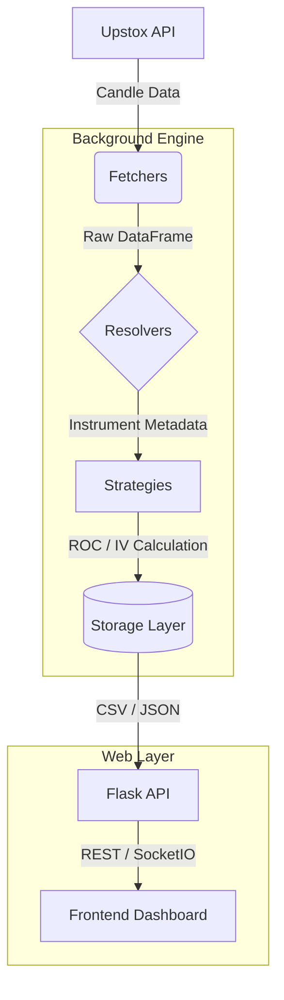

# 📖 Option App - Project Documentation

## 1. 🌟 System Overview
The **Option App** is a professional-grade, real-time and historical analytics platform for derivative traders. It specializes in processing option chain data for **NSE (Nifty 50)**, **BSE (Sensex)**, and **MCX (Crude Oil/Natural Gas)**. 

The system provides a unified dashboard to visualize complex metrics like **Implied Volatility (IV)**, **Open Interest (OI) Rate of Change (ROC)**, and **Volume trends**, allowing traders to identify market momentum and sentiment shifts with high precision.

---

## 2. 🏛️ System Architecture

The application is built on a **Modular Micro-Kernel** architecture, decoupling data acquisition from the visualization layer.

### 🔄 High-Level Data Flow

---

## ⚙️ 3. Low-Level Design (LLD)

### 3.1 Data Acquisition (Fetchers)
Located in `fetchers/`, this layer wraps the **Upstox SDK**. 
- **`IntradayCandleFetcher`**: Fetches the latest 1-minute or 5-minute candles for active instruments.
- **`HistoricalCandleFetcher`**: Backfills data for multi-day analysis.
- **`ExpiredCandleFetcher`**: Specifically designed to handle data for contracts that have already entered the expiry settlement period.

### 3.2 Analytical Engine (Strategies)
The engine utilizes the **Strategy Pattern** for data normalization and metric computation.

- **`NormalizationStrategy`**: An abstract base class for processing ROC.
    - **`DefaultROC`**: Standard percentage change with hard clipping (-100% to +100%).
    - **`SoftClip`**: Uses `np.tanh` to gently squash extreme spikes, maintaining trend sensitivity while preventing chart distortion.
    - **`AbsoluteDiff`**: Measures change in Basis Points (BPS).
- **`NormalizationFactory`**: Dynamically selects the appropriate strategy based on the metric type.

### 3.3 Scheduling & Locking
The system implements a **Time-Synchronized Scheduler**:
- **Trigger Window**: Market hours (09:15-15:30 IST for NSE/BSE).
- **Processing Offset**: Tasks trigger at `minute % 5 == 1` (e.g., 10:01, 10:06). This 1-minute buffer ensures the broker (Upstox) has finalized the previous 5-minute candle data before ingestion.
- **Locking Mechanism**: Thread-safe `_fetch_locks` prevent multiple concurrent fetches for the same symbol, ensuring data integrity.

---

## 📈 4. Analytical Models

### 4.1 Implied Volatility (IV)
The IV is calculated using the **Black-Scholes Model** with a **Newton-Raphson** numerical solver (`core/black_scholes.py`).
- **Inputs**: Current Spot Price, Strike Price, Time to Expiry ($T$), Risk-free Rate ($r$), and Option Market Price.
- **Convergence**: Iteratively solves for $\sigma$ until the model price matches the market price within a tolerance of $1e-4$.

### 4.2 Rate of Change (ROC)
The ROC calculation is the core of the dashboard's predictive capability:
- **Baseline**: For intraday data, the first candle of the day is anchored to the previous trading day's closing candle.
- **Calculation**: $ROC = \frac{Current - Previous}{Previous} \times 100$.
- **Noise Reduction**: Values are masked or zeroed if the previous base value (e.g., IV or OI) is below a specific threshold, preventing "infinite% growth" errors on low-liquidity strikes.

---

## 🖥️ 5. Interaction & Visualization

### 5.1 Real-Time Hub (SocketIO)
The `dashboard/` module manages a WebSocket hub that broadcasts updates to specific "Rooms" based on the selected symbol (e.g., room `NIFTY`).
- **`join_symbol`**: Clients join specific rooms to receive filtered updates, reducing client-side processing load.
- **Live Mode**: When toggled, the frontend stops polling polling REST endpoints and listens exclusively to SocketIO `data_updated` events.

### 5.2 Time-Travel Slider
The frontend (`static/js/app.js`) features a debounced time-slider.
- **Mechanism**: When the slider moves, it sends a timestamped request to `/api/option-data?time=HH:MM`.
- **Bootstrapping**: If a time-slice CSV doesn't exist, the backend immediately extracts the required slice from the main daily cumulative CSV, minimizing latency.

---

## 🛠️ 6. Technical Stack

| Category | Technology |
| :--- | :--- |
| **Backend** | Python 3, Flask |
| **Real-time** | Flask-SocketIO (eventlet) |
| **Data Processing** | Pandas, NumPy, SciPy |
| **API** | Upstox SDK |
| **Storage** | File-based (CSV/JSON) for high performance |
| **Frontend** | Vanilla JavaScript, Plotly.js |
| **Reliability** | Sentry SDK (Error tracking) |

---
*Generated: April 7, 2026*
